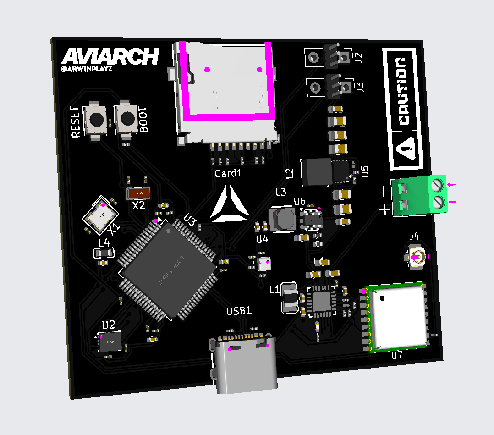
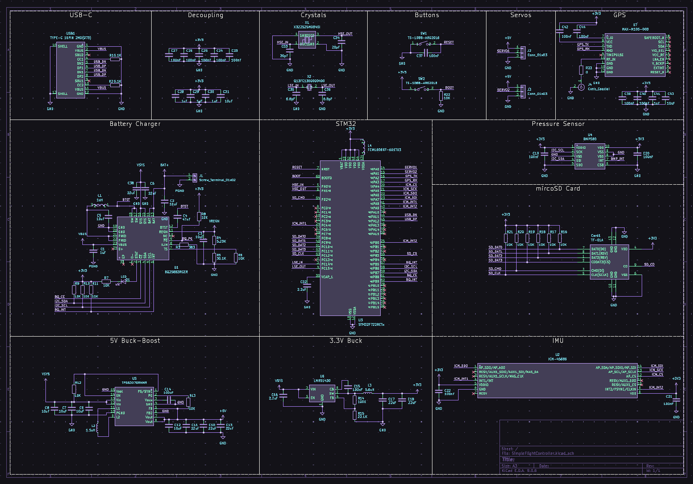
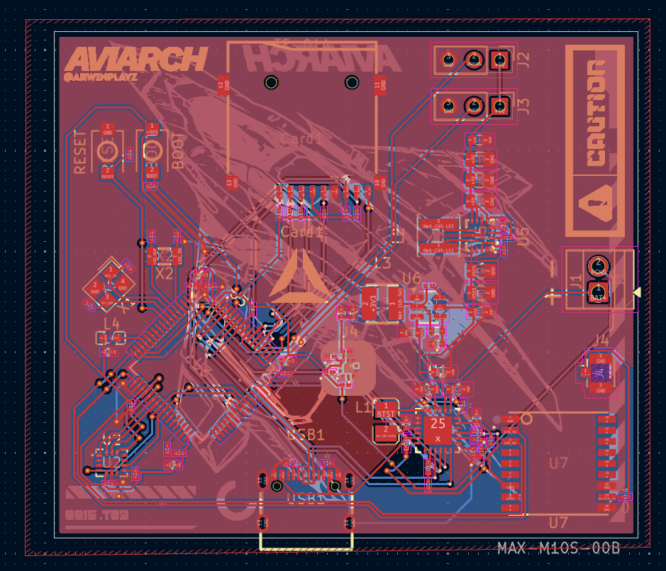

# Custom Flight Controller
A custom Flight Controller maded within kicad, specificaly for rockets.
---

## Project Overview
The goal was to create a custom Flight Controller which was capable of utilising TVC to guide a rocket.

---

## Screenshots

### 1. Overall
  

### 2. Schematic
  

### 3. PCB layout
  

### 4. Design
  

